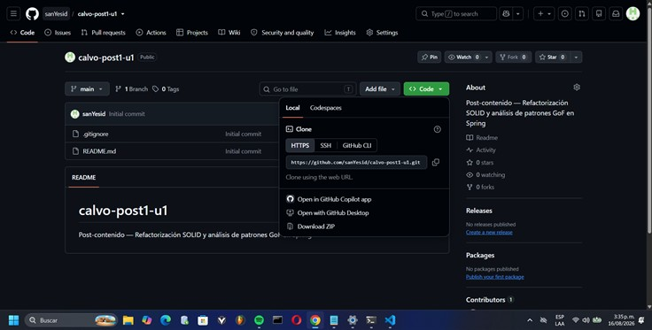
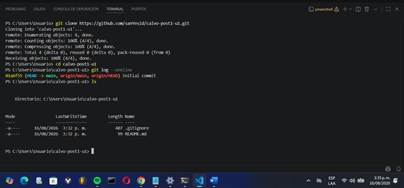
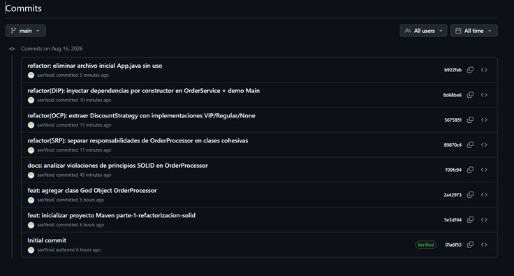
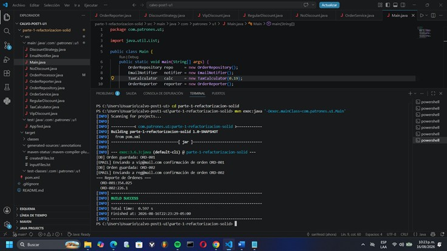
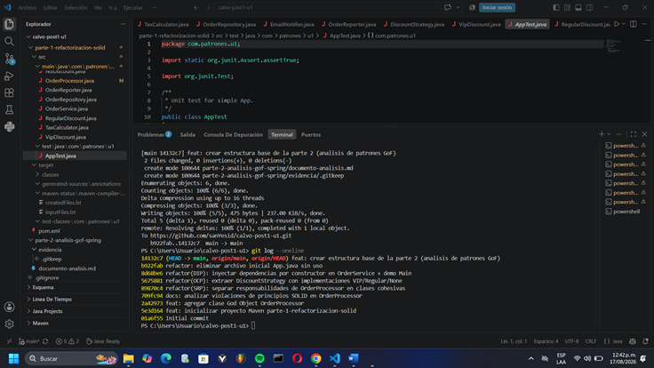
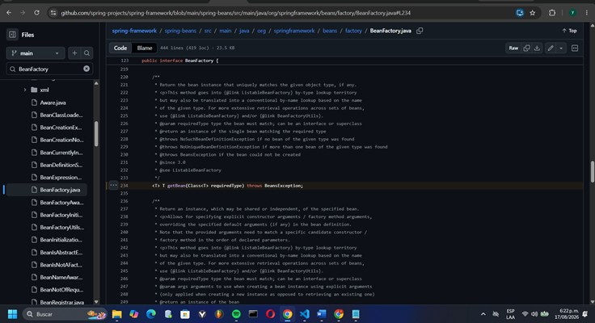
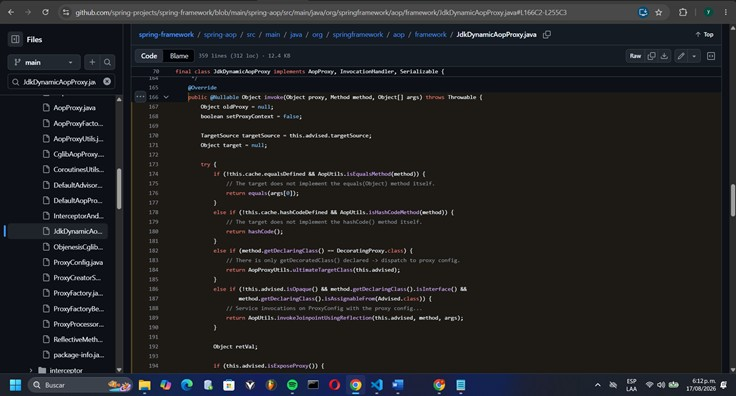
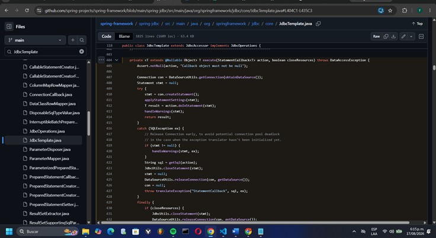
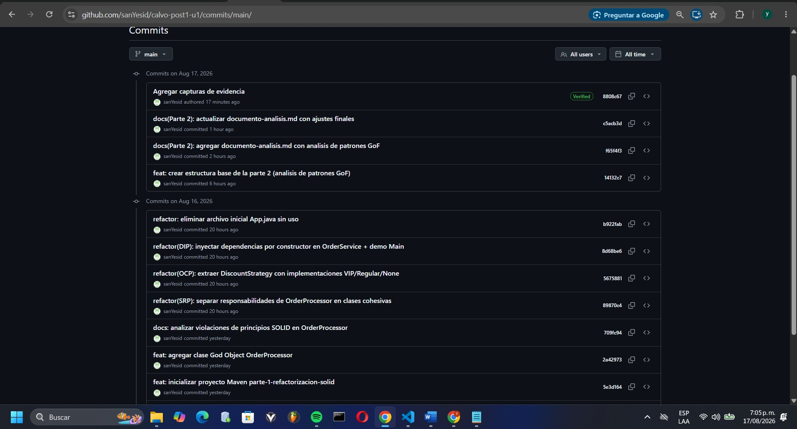
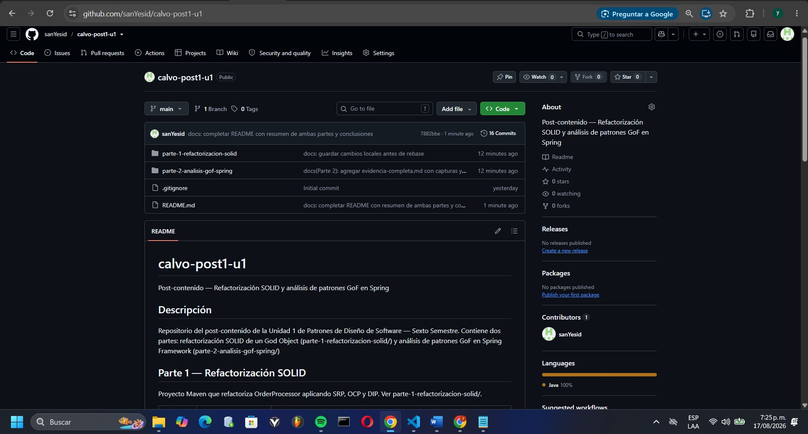

# Registro Unificado de Evidencias de Investigación y Ejecución

**Nombre del estudiante:** José Yesid Calvo Quintero  
**Código estudiantil:** 02240131050  
**Curso:** Patrones de Diseño de Software  
**Unidad:** Unidad 1 — Fundamentos de Patrones de Diseño  
**Fecha:** 17/08/2026

---

## Sección 1: Evidencias de la Parte 1 — Refactorización y Principios SOLID

### 1.Repositorio en GitHub y terminal con git log
Captura de pantalla de repositorio de GitHub y terminal con git log




### 2. Historial de Commits en Git
Captura de pantalla que evidencia el historial de commits incrementales realizados durante el proceso de refactorización:



### 3. Salida de mvn exec:java
Captura de pantalla que evidencia salida de mvn exec:java:



## 💻 Sección 2: Evidencias de la Parte 2 — Código Fuente de Spring Framework (GoF)

### 1. Captura de pantalla: estructura de carpetas completa (parte-1-refactorizacion-solid/ y parte-2-analisis-gof-spring/) en VS Code.



A continuación se presentan los fragmentos de código fuente real extraídos del repositorio oficial de Spring Framework (`spring-projects/spring-framework`), los cuales respaldan el análisis del documento principal.

## Evidencia — Patrón 1: Factory Method (Creacional)

### Identificación de la clase/interfaz

- **Interfaz:** `BeanFactory`
- **Paquete completo:** `org.springframework.beans.factory`
- **Módulo de Spring:** `spring-beans`
- **Ruta del archivo en el repositorio:** `spring-beans/src/main/java/org/springframework/beans/factory/BeanFactory.java`
- **Repositorio fuente:** https://github.com/spring-projects/spring-framework
- **Permalink (commit + líneas exactas):** https://github.com/spring-projects/spring-framework/blob/c7712052ce953722448967dc9c780fa959a08d48/spring-beans/src/main/java/org/springframework/beans/factory/BeanFactory.java#L156
https://github.com/spring-projects/spring-framework/blob/c7712052ce953722448967dc9c780fa959a08d48/spring-beans/src/main/java/org/springframework/beans/factory/BeanFactory.java#L177
https://github.com/spring-projects/spring-framework/blob/c7712052ce953722448967dc9c780fa959a08d48/spring-beans/src/main/java/org/springframework/beans/factory/BeanFactory.java#L234
- **Líneas de referencia (según el permalink anterior):** 123-444

### Fragmento de código consultado

```java
// org.springframework.beans.factory.BeanFactory
public interface BeanFactory {

    // El cliente solicita el objeto por nombre; no lo construye directamente.
    Object getBean(String name) throws BeansException;

    // Sobrecarga por tipo: el contenedor decide qué implementación concreta
    // instanciar y devolver, aplicando su propia lógica interna.
    <T> T getBean(String name, Class<T> requiredType) throws BeansException;

    <T> T getBean(Class<T> requiredType) throws BeansException;
}
```


Este fragmento confirma que `BeanFactory` actúa como un creador abstracto: el método `getBean(...)` es el punto único de acceso que expone el contenedor, pero la lógica real de construcción del objeto (elegir constructor, resolver dependencias, aplicar el scope singleton o prototype) queda oculta detrás de la interfaz, en implementaciones concretas como `AbstractBeanFactory`. El código cliente nunca escribe `new` sobre la clase del bean; delega esa decisión en el contenedor.

### Captura de pantalla




## Evidencia — Patrón 2: Proxy (Estructural)

### Identificación de la clase/interfaz

- **Clase:** `JdkDynamicAopProxy`
- **Paquete completo:** `org.springframework.aop.framework`
- **Interfaces implementadas:** `AopProxy`, `java.lang.reflect.InvocationHandler`, `java.io.Serializable`
- **Módulo de Spring:** `spring-aop`
- **Ruta del archivo en el repositorio:** `spring-aop/src/main/java/org/springframework/aop/framework/JdkDynamicAopProxy.java`
- **Repositorio fuente:** https://github.com/spring-projects/spring-framework
- **Permalink (commit + líneas exactas):** https://github.com/spring-projects/spring-framework/blob/c7712052ce953722448967dc9c780fa959a08d48/spring-aop/src/main/java/org/springframework/aop/framework/JdkDynamicAopProxy.java#L166-L255
- **Líneas de referencia (según el permalink anterior):** 166-255

### Fragmento de código consultado

Extracto real del método `invoke(...)`, copiado directamente del archivo en GitHub. Se omiten y marcan explícitamente las ramas iniciales de casos especiales (`equals()`, `hashCode()`, `exposeProxy`), que no son necesarias para explicar el patrón:

```java
@Override
public @Nullable Object invoke(Object proxy, Method method, Object[] args) throws Throwable {
    // (líneas omitidas: casos especiales de equals(), hashCode() y exposeProxy)
    target = targetSource.getTarget();
    Class<?> targetClass = (target != null ? target.getClass() : null);

    // Get the interception chain for this method.
    List<Object> chain = this.advised.getInterceptorsAndDynamicInterceptionAdvice(method, targetClass);

    if (chain.isEmpty()) {
        Object[] argsToUse = AopProxyUtils.adaptArgumentsIfNecessary(method, args);
        retVal = AopUtils.invokeJoinpointUsingReflection(target, method, argsToUse);
    }
    else {
        // We need to create a method invocation...
        MethodInvocation invocation =
                new ReflectiveMethodInvocation(proxy, target, method, args, targetClass, chain);
        // Proceed to the joinpoint through the interceptor chain.
        retVal = invocation.proceed();
    }
    return retVal;
}
```


`JdkDynamicAopProxy` implementa `InvocationHandler`, la interfaz estándar de Java para proxies dinámicos, lo que significa que cada llamada a un método del bean proxied pasa primero por `invoke(...)`. Ahí es donde Spring AOP intercala la lógica transversal (transacciones, seguridad, logging) antes de delegar finalmente en el objeto real (`target`). El proxy nunca contiene lógica de negocio propia: solo orquesta la interceptación.

### Captura de pantalla




## Evidencia — Patrón 3: Template Method (Comportamiento)

### Identificación de la clase/interfaz

- **Clase:** `JdbcTemplate`
- **Paquete completo:** `org.springframework.jdbc.core`
- **Interfaz de callback asociada:** `StatementCallback` (mismo paquete)
- **Módulo de Spring:** `spring-jdbc`
- **Ruta del archivo en el repositorio:** `spring-jdbc/src/main/java/org/springframework/jdbc/core/JdbcTemplate.java`
- **Repositorio fuente:** https://github.com/spring-projects/spring-framework
- **Permalink (commit + líneas exactas):** https://github.com/spring-projects/spring-framework/blob/c7712052ce953722448967dc9c780fa959a08d48/spring-jdbc/src/main/java/org/springframework/jdbc/core/JdbcTemplate.java#L404-L435
- **Líneas de referencia (según el permalink anterior):** 404-435

### Fragmento de código consultado

Extracto real del método privado `execute(StatementCallback, boolean)`, copiado directamente del archivo en GitHub. Se omite y marca explícitamente el detalle de liberación temprana de la conexión dentro del bloque `catch`:

```java
private <T extends @Nullable Object> T execute(StatementCallback<T> action, boolean closeResources) throws DataAccessException {
    Connection con = DataSourceUtils.getConnection(obtainDataSource());
    Statement stmt = null;
    try {
        stmt = con.createStatement();
        applyStatementSettings(stmt);
        T result = action.doInStatement(stmt);
        handleWarnings(stmt);
        return result;
    }
    catch (SQLException ex) {
        // (líneas omitidas: liberación temprana de la conexión y traducción del SQL de error)
        throw translateException("StatementCallback", sql, ex);
    }
    finally {
        if (closeResources) {
            JdbcUtils.closeStatement(stmt);
            DataSourceUtils.releaseConnection(con, getDataSource());
        }
    }
}
```

El método `execute(...)` de `JdbcTemplate` define un esqueleto invariable: obtener la conexión, crear el `Statement`, aplicar su configuración y liberar los recursos en el bloque `finally`. Ese flujo es idéntico para cualquier operación JDBC. La única línea que representa la parte variable del algoritmo es `action.doInStatement(stmt)`, donde se delega en la implementación de `StatementCallback` que provee el desarrollador. Esto evita que cada DAO tenga que reescribir el manejo de conexiones y excepciones.

### Captura de pantalla




### Historial de commits Final
Captura de pantalla de historial de commits desde GitHub




### Captura de pantalla del repositorio en GitHub con README renderizado y listado de archivos.





